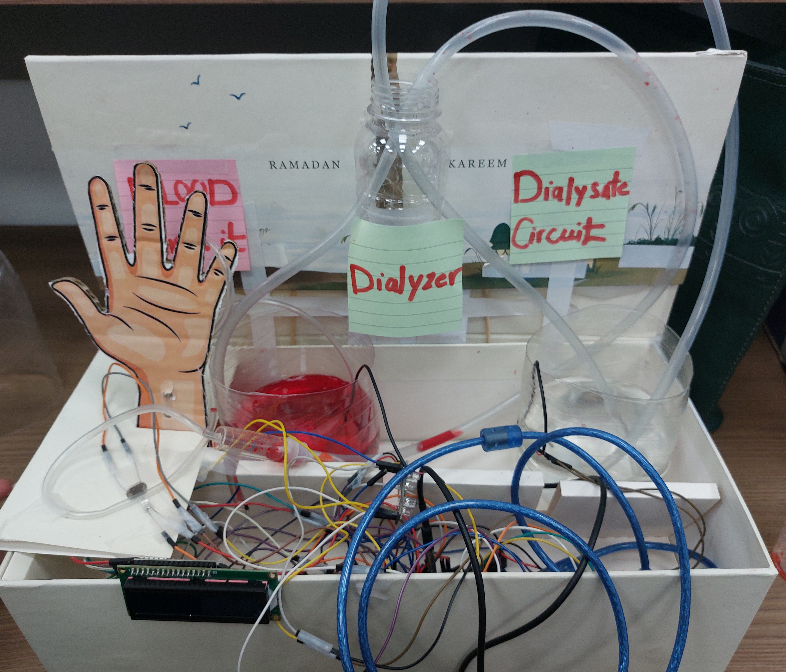

# Hemodialysis Machine Prototype with Computer Vision Integration



---

## Overview

This project presents a **Hemodialysis Machine Prototype with Computer Vision (CV) Integration**, designed to enhance patient safety through **multi-sensor monitoring**, **intelligent alarm handling**, and **automated pump control**. The system integrates embedded sensing, real-time control, and external CV-based patient state analysis into a single unified medical prototype.

The prototype continuously monitors **blood leakage**, **air bubbles**, and **patient temperature**, while receiving **patient posture/state information** from a Python-based Computer Vision system.

---

## System Architecture

The system consists of three main layers:

### 1. Embedded Control Layer (Arduino)

* Central controller handling all sensors and actuators
* Real-time safety monitoring and decision making

### 2. Sensor Layer

* **TCS3200 Color Sensor** – Blood leak detection using RGB and frequency analysis
* **LDR Sensor** – Air bubble detection in blood tubing
* **DS18B20 Temperature Sensor** – Patient blood temperature monitoring

### 3. Computer Vision Layer (External – Python)

* Detects patient state and posture
* Sends status codes to Arduino:

  * `0` → Normal
  * `1` → Possible issue (warning)
  * `2` → Alarm (e.g., head droop)
  * `3` → Patient missing

---

## Hardware Components

* Arduino microcontroller
* TCS3200 Color Sensor
* LDR (Bubble Detection)
* DS18B20 Digital Temperature Sensor
* Dual DC Pumps with H-Bridge Driver
* 16×2 I2C LCD
* Buzzer and Status LED
* UV LED for enhanced optical sensing

---

## Key Features

### Blood Leak Detection (Multi-Method)

Blood leakage is detected using **five independent methods** for high reliability:

* RGB intensity thresholds
* Red color dominance (frequency-based)
* Red/Green ratio analysis
* Red/Blue ratio analysis
* Combined RGB pattern matching

A confidence-based algorithm confirms leakage only after repeated detections, minimizing false alarms.

---

### Air Bubble Detection

* Continuous monitoring using LDR sensor
* Detects bubbles passing through the tubing
* Triggers immediate pump shutdown and alarm

---

### Temperature Monitoring

* Uses DS18B20 digital temperature sensor
* High-temperature alarm triggered when temperature exceeds **38°C**

---

### Computer Vision Integration

* Receives patient status from a Python CV system via serial communication
* Automatically reacts to CV alerts:

  * Stops pumps on critical alarms
  * Displays warnings and alarms on LCD
  * Activates buzzer and LED indicators

---

## Operating Logic

* **Normal Operation**: Pumps running, system monitoring
* **Warning State**: Pumps running with visual warning
* **Alarm State**: Pumps stopped, buzzer and LED activated
* **Fail-Safe Mode**: Pumps stop if CV connection is lost or critical sensor alarm occurs

---

## LCD Display States

* Normal operation with temperature and sensor readings
* Blood leak alarm with confidence level
* Air bubble alarm
* High temperature alert
* CV warnings and patient-missing alarms

---

## Serial Communication Protocol

### Commands Received from Python

* `PYTHON_READY`
* `CV:<state>`
* `RESET_BUBBLE`
* `RESET_BLOOD`
* `SET_THRESHOLD:<value>`
* `SET_BLOOD_THRESHOLDS:redMin,redMax,greenMax,blueMax`
* `CALIBRATE:redMin,redMax,greenMin,greenMax,blueMin,blueMax`

### Status Data Sent to Python

```
STATUS:cvState,tempC,redFreq,redVal,ldr,pumpA,pumpB,bubbleState,bloodDetected,leakConfirmed,confidence
```

---

## Safety Mechanisms

* Automatic pump shutdown on:

  * Blood leakage
  * Air bubble detection
  * High temperature
  * Critical CV alerts
* Audible and visual alarms
* Confidence-based detection to reduce false positives

---

## Conclusion

This **Hemodialysis Machine Prototype with CV Integration** demonstrates a robust biomedical system that combines **embedded sensing**, **intelligent signal processing**, and **computer vision-based patient monitoring**. The design prioritizes patient safety, reliability, and fault tolerance, making it suitable as an academic and research-oriented medical prototype.

---
